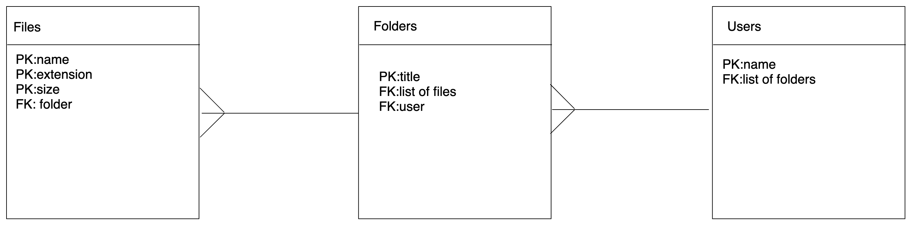

# wk13d2hw

## Brief

Create a one-to-many Spring application using annotations as you've done before.

 Your application should have the following models: `Folders`, `Files` and `Users`. Users should have many folders, and folders should have many files.

### MVP

- Create a system to track files and folders:
  - A `File` should have:
     - a name
     - extension (e.g. txt, rb, java, ppt)
     - size
     - folder
  - A `User` should have:
     - name
     - a list of folders
  - A `Folder` should have:
     - a title
     - list of files
     - a user
     
- Creata a seeding file `DataLoader` component to pre-seed the database.
- Test the routes with Insomnia

## Planning

